# Dot File Manager Design

This document specifies the design of a Bun-based dot file manager. It describes the tool's conceptual model, architecture, and operational phases.

---

## 1. Overview

The manager provides a declarative system for configuring environments across platforms. Core implements structured phases (analyze, plan, apply) and the execution engine, and it uses plugins for capabilities. Profiles allow environment-aware configuration.

---

## 2. Core Concepts

### 2.1 Plugins

Plugins are provider bundles (brew, apt, file, git). They must be **ready** before use. Each defines schemas, probe functions, diffing, and actions. They enforce idempotency and lock when required.

### 2.2 Managed Items

Items are atomic declarative targets (package, file, dir, service, env var, secret). Each has an id, desired spec, dependencies, probe, diff, and actions. Conflicts must be resolved by ownership or explicit replacement.

### 2.3 Phases

- **Analyze**: Validates config, matchers, schemas, and detects conflicts.
- **Plan**: Produces a DAG of actions with diffs and previews.
- **Apply**: Executes a plan deterministically with locks and rollback policies.

---

## 3. Repository Layout

### 3.1 plugins/

Holds plugin manifests, policies, and docs. Each plugin declares capabilities and setup requirements.

### 3.2 packages/

Holds `@dot-steward/core` (which includes phases and the execution engine) and `@dot-steward/types`.

### 3.3 plugins/

Provider plugins (brew, apt, file, git, repos). The former `repos` package is now a plugin: `@dot-steward/plugin-repos`.

### 3.4 apps/

Bundles of packages, configs, and managed items. Apps are composable and platform-aware.

---

## 4. Profiles and Matchers

### 4.1 Profiles

Profiles are named config units. They can include other profiles, define variables, apps, plugins, and items. All matching profiles apply. Order is determined by includes, priority, and stable tie-breaks.

### 4.2 Matchers

Declarative predicates evaluate host facts (os, distro, arch, user, hostname, env, container, virtualization). Composition supports `all`, `any`, and `not`. Includes respect matcher results.

---

## 5. Planning and Execution

### 5.1 Plan Format

Plans are deterministic artifacts with a header, nodes (actions), edges (dependencies and locks), and previews. They are reproducible and hash-stable.

### 5.2 Execution Engine

Core's execution engine runs under Bun, isolates plugins, and uses locks for concurrency. Actions are idempotent. Apply consumes only validated plans.

---

## 6. State and Caching

A local state store tracks plugin readiness, probes, checksums, and last plans. Cache directories store templates, archives, and diffs. Integrity is ensured with hashing.

---

## 7. Diagnostics and CLI

### 7.1 Analyze Output

Reports validation errors, conflicts, and lints.

### 7.2 Plan Output

Shows action counts, risk summary, and DAG preview.

### 7.3 Apply Output

Reports execution progress, timings, and results. Logs are machine-readable.

### 7.4 CLI Commands

- `analyze`
- `plan`
- `apply`
- `profiles list|matched|graph|explain`

---

## 8. Security and Safety

- Signatures verify plugins and plans.
- Privilege escalation is minimal and controlled.
- Secrets are referenced, never stored.
- Rollbacks are declared per action.
- Conflicts and cycles are fatal unless explicitly overridden.

---

## 9. Extensibility

New plugins and item kinds can be added via manifests and contracts. Community catalogs are possible with signature verification.

---

## 10. Guarantees

- No item probes without plugin readiness.
- Apply always consumes a plan artifact.
- Plans are deterministic and auditable.
- Many profiles can apply simultaneously.
- Every action is idempotent and ordered by DAG constraints.

# Class Diagram

```mermaid
classDiagram
direction TB

%% Top-level
class DotFileManager {
  +analyze(cfg): AnalyzeReport
  +plan(cfg): Plan
  +apply(plan: Plan): ApplyReport
}

class CLI {
  +analyze()
  +plan()
  +apply()
  +profilesList()
  +profilesMatched()
  +profilesGraph()
  +profilesExplain()
}
CLI ..> DotFileManager : invokes

%% Phases
class Phase {
  +run(): any
}
<<abstract>> Phase
Phase <|-- AnalyzePhase
Phase <|-- PlanPhase
Phase <|-- ApplyPhase

class AnalyzePhase { +validateSchemas() +resolveProfiles() +detectConflicts() +lint() }
class PlanPhase { +buildDAG() +diffPreview() +emitPlan(): Plan }
class ApplyPhase { +executePlan(plan: Plan): ApplyReport }

DotFileManager o-- AnalyzePhase
DotFileManager o-- PlanPhase
DotFileManager o-- ApplyPhase
AnalyzePhase --> AnalyzeReport
PlanPhase --> Plan
ApplyPhase ..> ExecutionEngine

%% Repository layout
class PluginsRepo { +list() +get(id) }
class PackagesRepo { +resolve(name): PackageMapping }
class AppsRepo { +get(name): App }

AnalyzePhase ..> PluginsRepo : validate
AnalyzePhase ..> PackagesRepo : validate
AnalyzePhase ..> AppsRepo : validate

class PluginManifest { +id +capabilities[] +setupRequirements[] +policies[] }
PluginsRepo *-- PluginManifest

class PackageMapping { +abstractName +providerDefs: map }
PackagesRepo *-- PackageMapping

class App { +name +packages[] +items[] +platformAware: bool }
AppsRepo *-- App

%% Profiles and matchers
class Profile {
  +name
  +priority
  +variables
  +includes[]
  +apps[]
  +plugins[]
  +items[]
  +matched(facts): bool
}
class Matcher { +predicates +compose(all, any, not) +eval(facts): bool }
class HostFacts { os distro arch user hostname env container virtualization }

Profile --> Matcher
Matcher --> HostFacts
Profile --> App
Profile --> ManagedItem
Profile --> Plugin
Profile o-- Profile : includes
AnalyzePhase ..> Profile : resolves

%% Plugins and items
class Plugin {
  +id
  +capabilities[]
  +ready: bool
  +setup()
  +schema()
  +probe(item)
  +diff(cur, desired)
  +act(node)
  +lockScope(node)
}
PluginManifest --> Plugin : defines

class ManagedItem {
  +id
  +kind
  +spec
  +deps[]
  +owner?
  +probe()
  +diff()
  +actions()
  +validate()
}
<<abstract>> ManagedItem
ManagedItem ..> Plugin : requires

class PackageItem
class FileItem
class DirItem
class ServiceItem
class EnvVarItem
class SecretItem

ManagedItem <|-- PackageItem
ManagedItem <|-- FileItem
ManagedItem <|-- DirItem
ManagedItem <|-- ServiceItem
ManagedItem <|-- EnvVarItem
ManagedItem <|-- SecretItem

%% Planning
class Plan {
  +header
  +nodes[]
  +edges[]
  +previews[]
  +hash
  +serialize()
  +computeHash()
}
class ActionNode {
  +id
  +itemId
  +action
  +diff
  +locks[]
  +rollback: RollbackPolicy
  +risk
}
class Edge { +from +to +type: "dep|lock" }
class Diff { +current +desired +changes +idempotent: bool }
class RollbackPolicy { +strategy +steps[] }

Plan *-- ActionNode
Plan *-- Edge
ActionNode ..> ManagedItem : targets
ActionNode ..> Diff
Plan ..> Diff : previews

%% Execution
class ExecutionEngine {
  +concurrency
  +execute(plan): ApplyReport
  +acquireLocks()
  +callPlugin()
  +rollback()
  +idempotentCheck()
  +verifySignatures()
}
class BunRuntime { +version }
class PluginSandbox { +isolate(plugin) }
class LockManager { +lock(scope) +unlock(scope) }
class StateStore { +pluginReadiness +probes +checksums +lastPlans +get() +put() }
class CacheStore { +templates +archives +diffs +hash(data) +get() +put() }
class SignatureService { +verifyPlugin() +verifyPlan() }
class PrivilegeManager { +withElevation(action) }
class SecretsResolver { +resolve(ref) }

ExecutionEngine ..> BunRuntime
ExecutionEngine ..> PluginSandbox
ExecutionEngine ..> LockManager
ExecutionEngine ..> Plugin
ExecutionEngine ..> StateStore
ExecutionEngine ..> CacheStore
ExecutionEngine ..> SignatureService
ExecutionEngine ..> PrivilegeManager
ExecutionEngine ..> SecretsResolver
ApplyPhase ..> Plan : consumes
ExecutionEngine ..> Plan

%% Diagnostics
class AnalyzeReport { +errors[] +conflicts[] +lints[] }
class PlanReport { +actionCounts +riskSummary +dagPreview }
class ApplyReport { +progress +timings +results +machineReadableLog }

CLI ..> AnalyzeReport
CLI ..> PlanReport
CLI ..> ApplyReport

%% Notes
note for Plan "Deterministic artifact: header, nodes, edges, previews. Hash-stable."
note for DotFileManager "Guarantees: no probes before plugin ready; apply consumes plan; deterministic and auditable; multiple profiles may apply; actions idempotent and DAG-ordered."
note for SignatureService "Safety: signatures verify plugins and plans; secrets are referenced only; minimal privilege; conflicts and cycles are fatal unless explicitly overridden."
```

